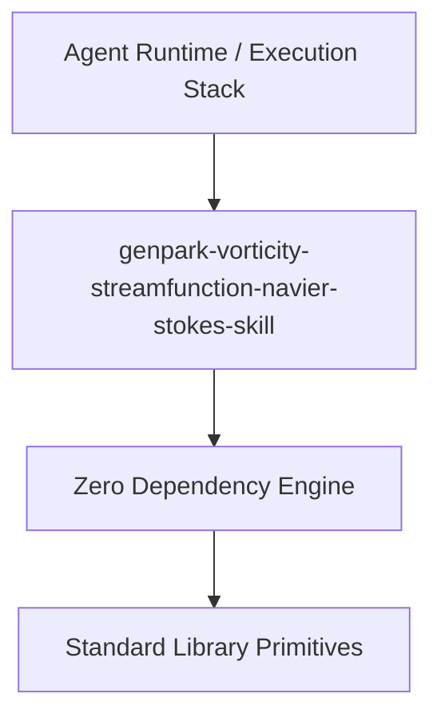

# genpark-vorticity-streamfunction-navier-stokes-skill

[](https://github.com/alphaparkinc/genpark-vorticity-streamfunction-navier-stokes-skill)
[](https://github.com/alphaparkinc/genpark-vorticity-streamfunction-navier-stokes-skill)
[](https://www.python.org/)

2D incompressible Navier-Stokes vorticity-streamfunction solver using discrete Poisson relaxation and kinematic vortex convection.



## Features
- **Strict 0 Pip Dependencies**: Built completely using the Python Standard Library.
- **Fast Execution & Verification**: Includes client wrapper, MCP server, and verified test suites.
- **Agentic AI Ready**: Exposes standard MCP tools for continuous LLM integration.

## Installation & Quickstart
```bash
git clone https://github.com/alphaparkinc/genpark-vorticity-streamfunction-navier-stokes-skill.git
cd genpark-vorticity-streamfunction-navier-stokes-skill
python example_usage.py
```
